# renju5web — 基于 Flask + Vue 的五子棋对战系统

一个支持 **人机对战（AlphaZero AI）** 和 **玩家在线匹配对战** 的 Web 五子棋系统，附带完整的用户注册登录、战绩历史与棋局回放功能。

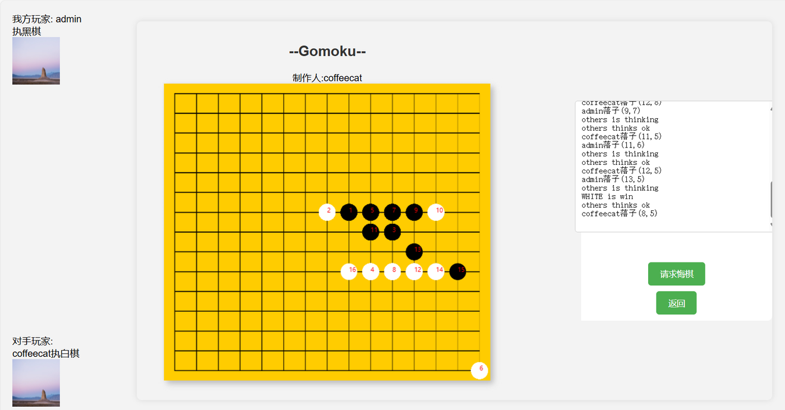
<div align="center"><sub>双人在线对战实况：右侧实时滚动落子日志</sub></div>

## ✨ 功能特性

- 🤖 **人机对战**：AI 基于简化版 AlphaZero 算法（MCTS + Policy-Value Network），提供简单 / 复杂两档模型
- 👥 **双人在线对战**：玩家匹配机制，匹配成功后轮流落子对弈
- 🔐 **用户系统**：注册、登录、个人资料与头像上传
- 📜 **战绩与回放**：历史对局记录查询、删除，棋局记忆回放
- 🗄️ **MySQL 持久化**：用户、对局、落子、训练数据四张表（早期使用 SQLite，因并发能力不足迁移至 MySQL）

## 🖼 界面预览

| 登录 | 注册 |
| :---: | :---: |
|  |  |
| <sub>渐变背景 + Element-UI 表单</sub> | <sub>字段级错误提示</sub> |

| 人机对战 | 双人在线对战 |
| :---: | :---: |
| 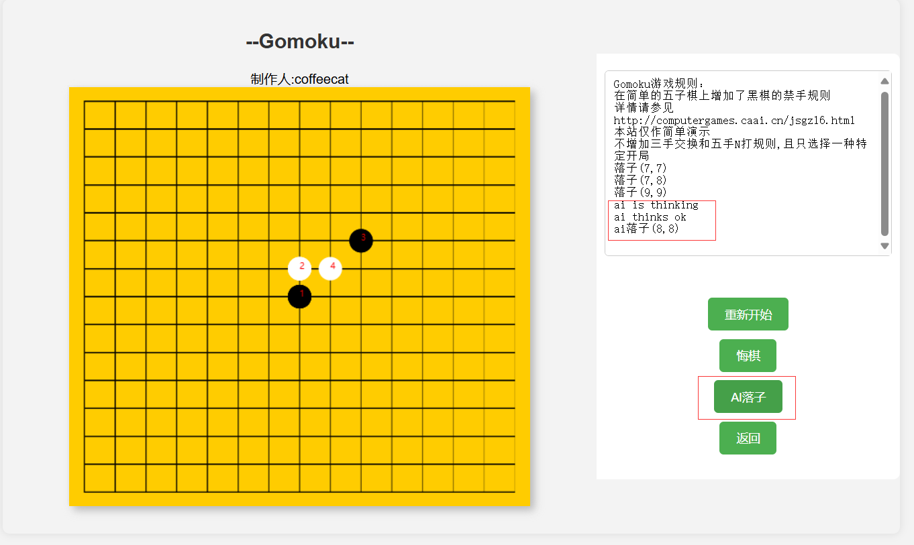 | 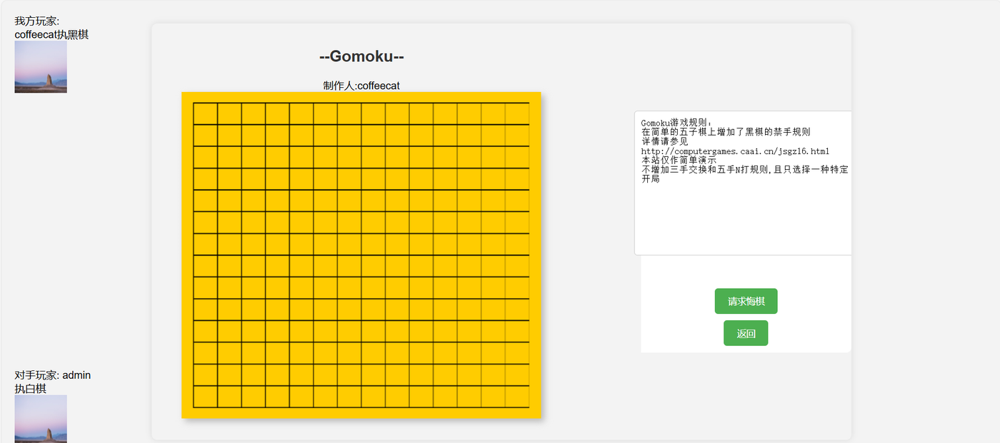 |
| <sub>AI 落子 / 悔棋 / 重新开始，右侧对局日志</sub> | <sub>匹配成功后展示双方玩家与执子颜色</sub> |

| 历史战绩 | 棋局回放 |
| :---: | :---: |
| 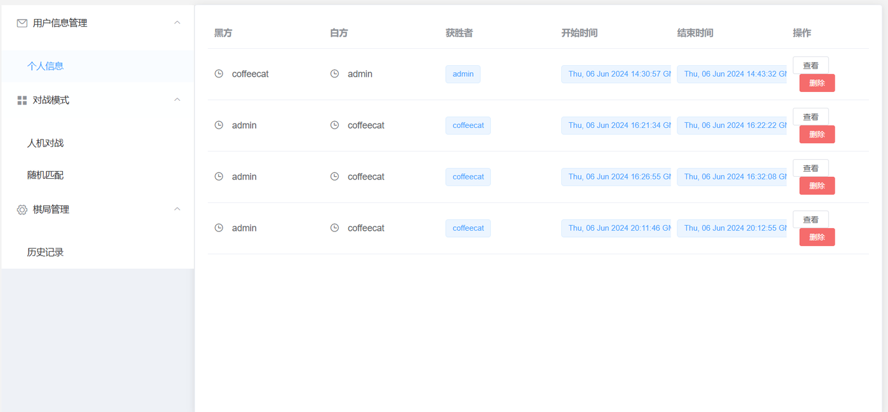 | 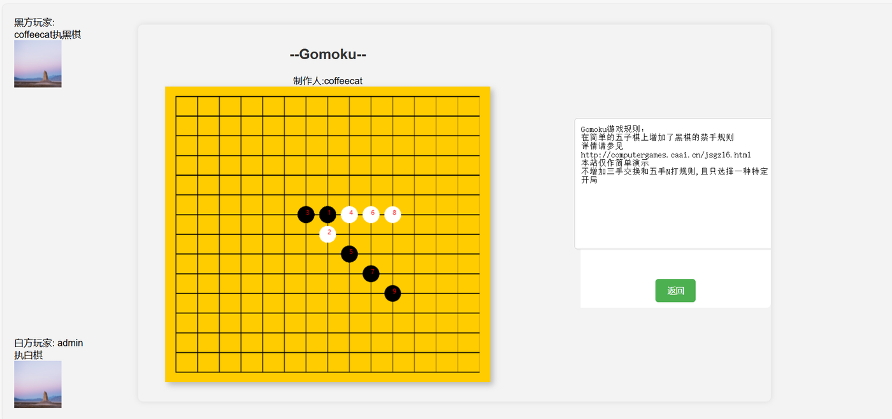 |
| <sub>胜负 / 起止时间一览，支持查看与删除</sub> | <sub>按落子顺序记忆回放整局棋</sub> |

## 🛠 技术栈

| 层次 | 技术 |
| --- | --- |
| 后端 | Python / Flask（Blueprint 模块化路由）、Flask-CORS |
| AI | PyTorch、MCTS + AlphaZero（Policy-Value Net） |
| 前端 | Vue 2、Element-UI、原生 JS（CDN 引入，Jinja 模板渲染页面） |
| 通信 | Axios（HTTP 轮询，未使用 WebSocket） |
| 数据库 | MySQL 5.7（PyMySQL 连接） |

## 🏗 系统设计

**功能结构**：用户 / 对战 / 棋局 / 训练资料四大模块

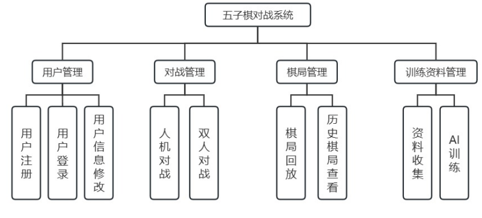

**业务流程**：注册登录 → 选择对战模式 → 对弈 / 回放 → 结束

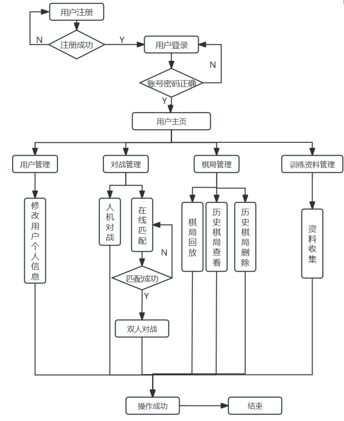

## 📁 项目结构

```text
renjuweb
├── Connect5web                 # 主项目
│   └── app
│       ├── main.py             # Flask 入口，注册各 Blueprint
│       ├── front.py            # 静态页面路由
│       ├── database.py         # MySQL 连接配置
│       ├── auth/               # 注册 / 登录接口
│       ├── users/              # 用户信息 / 头像接口
│       ├── game/
│       │   ├── renju.py        # 人机对战接口（/renju/getMove）
│       │   ├── pk.py           # 玩家匹配与对战接口（/pk/matchPlayers）
│       │   ├── history.py      # 战绩 / 回放接口
│       │   ├── backened/       # AlphaZero 算法实现（MCTS、PolicyValueNet、规则）
│       │   └── model/          # AI 模型权重（⚠️ 强模型文件未包含在仓库中）
│       └── templates/          # Vue + Element-UI 前端页面与 js/css
├── docs/images/                # README 界面截图与设计图
└── 如何建立数据库/
    ├── connect5web.sql         # 数据库建表 + 初始数据转储
    └── *.png                   # 各表结构截图（与 docs/images/db-*.png 同源）
```

## 🚀 快速开始

### 1. 初始化数据库

创建 MySQL 数据库并导入 SQL 转储文件：

```sql
CREATE DATABASE connect5web DEFAULT CHARACTER SET utf8mb4;
```

```bash
mysql -u root -p connect5web < 如何建立数据库/connect5web.sql
```

数据库共 4 张表，E-R 关系与表结构如下：

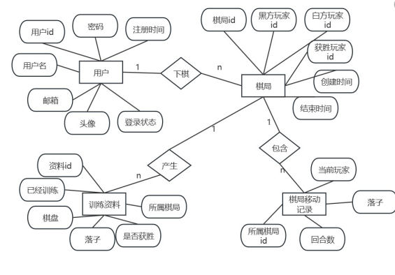

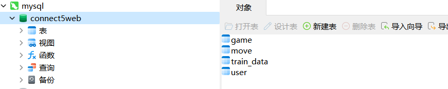

<details>
<summary>📷 各表结构截图（user / game / move / train_data）</summary>

| user 用户表 | game 棋局表 |
| :---: | :---: |
| 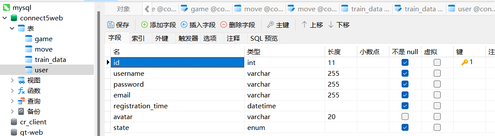 | 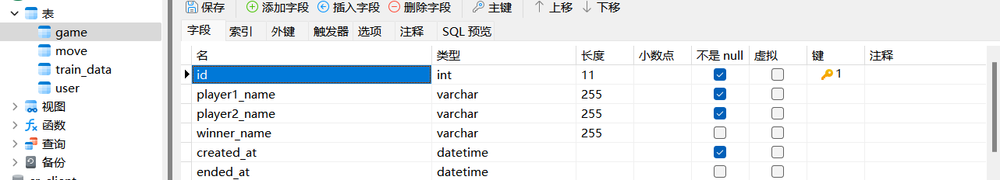 |

| move 落子表 | train_data 训练数据表 |
| :---: | :---: |
| 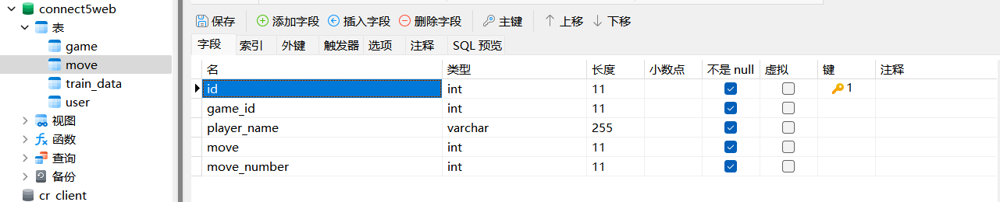 | 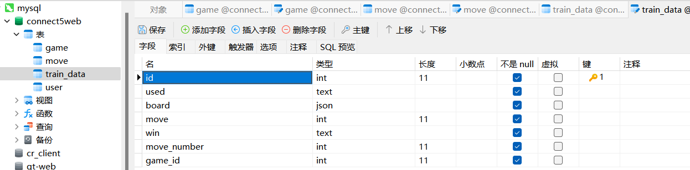 |

</details>

### 2. 修改数据库连接

编辑 `Connect5web/app/database.py`，改为你本地的 MySQL 账号密码：

```python
pymysql.connect(host='localhost', user='root', password='你的密码', db='connect5web', ...)
```

### 3. 安装依赖并运行

```bash
cd Connect5web
pip install flask flask-cors flask-sockets pymysql torch
python -m app.main
```

服务默认运行在 `http://localhost:5500`。

### 4. 关于 AI 模型

`app/game/model/` 目录下仅包含简单模型，训练好的强模型权重文件（`20b128c_renju.pt` 完整版）**未包含在本仓库中**，详见该目录下的说明文件。可自行使用 `app/game/backened/train.py` 训练。

## ⚠️ 已知问题 / TODO

- [ ] 对战通信基于 HTTP 轮询（Axios），未使用 WebSocket，实时性欠佳
- [ ] 双人匹配逻辑与对战逻辑耦合，计划解耦为独立的匹配模块
- [ ] 数据库连接配置硬编码在源码中，应改为环境变量 / 配置文件
- [ ] 缺少 `requirements.txt` 与自动化测试

## 📄 License

本项目仅供学习交流使用。
